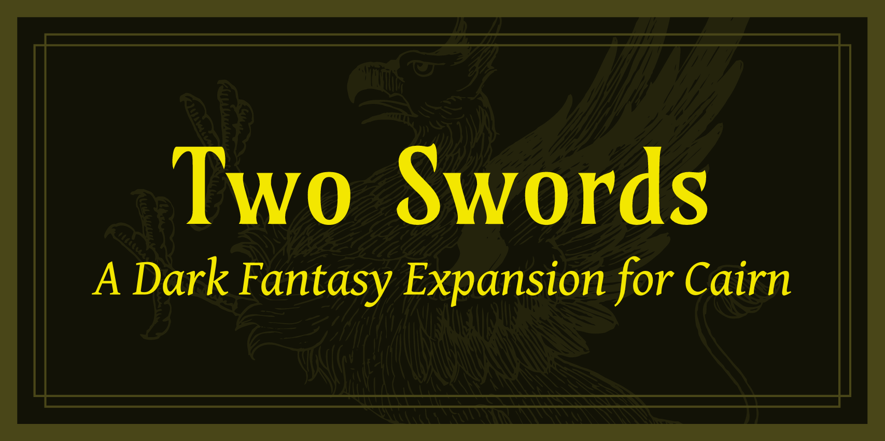

---

# Two Swords

A dark fantasy expansion to use with the [Cairn] adventure game.

## Contributing

It's pretty technical, but you need to install [typst] and [just].

`two-swords.typ` is the main typst document.
`lib.typ` is a little helper document to keep the main document clean.

To build the PDF, run `just build` in root project.
This will produce a `TwoSwords-dev.pdf` file that you can open in a PDF viewer.

To watch files and continuously build the PDF, run `just` in the root project directory.
PDF viewers often will automatically refresh if they detect an opened PDF has changed on disk.
This means when running the `just` command, if you open `TwoSwords-dev.pdf` in a PDF viewer,
it likely will keep refreshing the viewer with your changes as you make them.
Any `.typ` or `.yaml` file change will trigger a new PDF build.

All of the stats live in the `stats` directory.
They are yaml files that the typst document consumes and renders stat blocks out of.

## COPYING

If you're just copying the content of the PDF, CC-BY-SA works just fine.
If you are copying the code, AGPLv3 is what you should use.
CC-BY-SA is compatible with AGPLv3.

[Cairn]: https://cairnrpg.com/
[typst]: https://github.com/typst/typst
[just]: https://github.com/casey/just